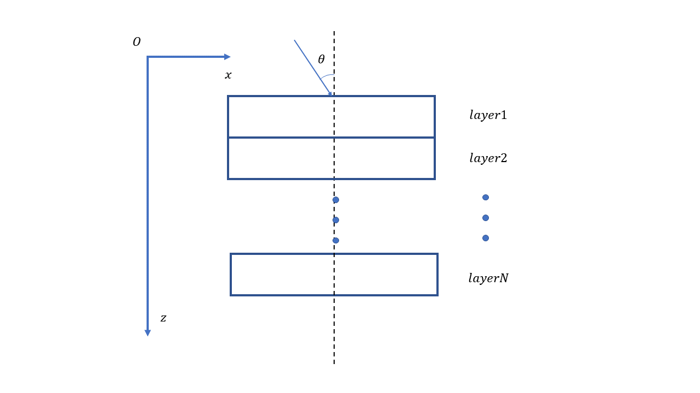

# 传输矩阵法C++代码实现

## 原理

## 使用
使用Visual Studio 2022开发，C++矩阵计算库Armadillo。
### 安装
Visual Studio 2022安装Armadillo

	git clone https://github.com/microsoft/vcpkg.git
	cd vcpkg
	.\bootstrap-vcpkg.bat
	.\vcpkg install Armadillo
	.\vcpkg integrate install

### 文件结构

### 用法
器件结构的输入文件为content.json，数据结构如下
	
	{
    "device": [
        {
            "thickness": 1e-6,
            "indexReal": 1,
            "indexImag": 0.01
        },
        {
            "thickness": 1e-6,
            "indexReal": 1,
            "indexImag": 0.01
        },
        {
            "thickness": 1e-6,
            "indexReal": 3,
            "indexImag": 0.8
        }
    ],
    "source": {
        "theta": 75, 
        "lambda": 0.8e-6
    }
}

## 测试结果
