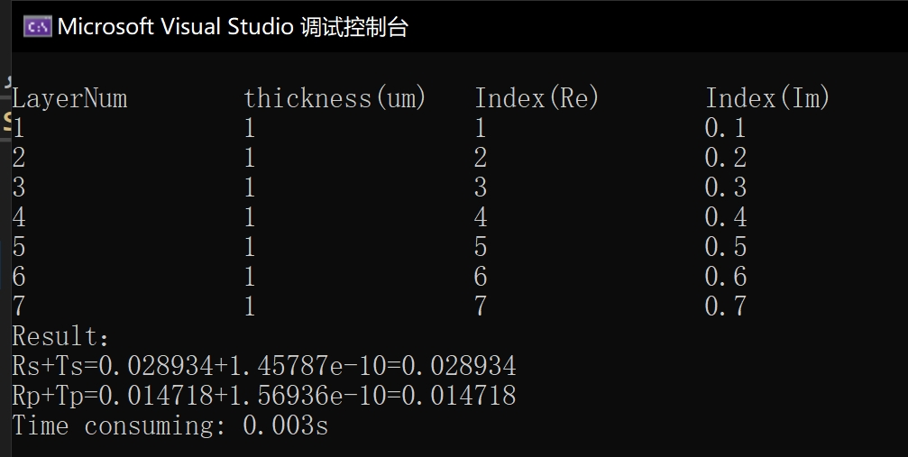

# 传输矩阵法C++代码实现

## 原理
传输矩阵法是一种用于分析和设计多层光学、电磁学或声学系统的方法。它通过将系统分解为一系列基本层，并利用矩阵运算来描述每层对波的传播特性的影响，从而高效地计算整个系统的传输或反射特性。这种方法广泛应用于光学薄膜设计、光波导分析、声学多层结构分析等领域。


## 使用
使用Visual Studio 2022开发，C++矩阵计算库Armadillo。
### 安装
Visual Studio 2022安装Armadillo

	git clone https://github.com/microsoft/vcpkg.git
	cd vcpkg
	.\bootstrap-vcpkg.bat
	.\vcpkg install Armadillo
	.\vcpkg integrate install

### 文件目录说明

```
├─images
├─src
├─TMM
│  └─x64
│      ├─Debug
│      │  └─TMM.tlog
│      └─Release
│          └─TMM.tlog
└─x64
    ├─Debug
    └─Release
```


### 用法
器件结构的输入文件为content.json，数据结构如下
```
{
    "device": [
        {
            "thickness": 1e-6,
            "indexReal": 1,
            "indexImag": 0.1
        },
        {
            "thickness": 1e-6,
            "indexReal": 2,
            "indexImag": 0.2
        },
        {
            "thickness": 1e-6,
            "indexReal": 3,
            "indexImag": 0.3
        },
        {
            "thickness": 1e-6,
            "indexReal": 4,
            "indexImag": 0.4
        },
        {
            "thickness": 1e-6,
            "indexReal": 5,
            "indexImag": 0.5
        },
        {
            "thickness": 1e-6,
            "indexReal": 6,
            "indexImag": 0.6
        },
        {
            "thickness": 1e-6,
            "indexReal": 7,
            "indexImag": 0.7
        }
    ],
    "source": {
        "theta": 30,        
        "lambda": 1.55e-6
    }
}


```


## 测试结果

| Layer | thickness(um) | Index(Re) | Index(Im)|
| ---|---|---|---|
|  1| 1|1|0.1|
|  2| 1|2|0.2|
|  3| 1|3|0.3|
|  4| 1|4|0.4|
|  5| 1|5|0.5|
|  6| 1|6|0.6|
|  7| 1|7|0.7|

使用TMMsolver的结果为



| |C++| Lumerical |
|---|---|---|
|Rs|0.028934|0.028934|
|Ts|1.45787e-10|1.45787e-10|
|Rp|0.014718|0.014718|
|Tp|1.56936e-10|1.56936e-10|
 

 ```
C++
Rs+Ts=0.028934+1.45787e-10=0.028934
Rp+Tp=0.014718+1.56936e-10=0.014718

Lumerical
Rs+Ts=0.028934 + 1.45787e-10 = 0.028934
Rp+Tp=0.014718 + 1.56936e-10 = 0.014718
```