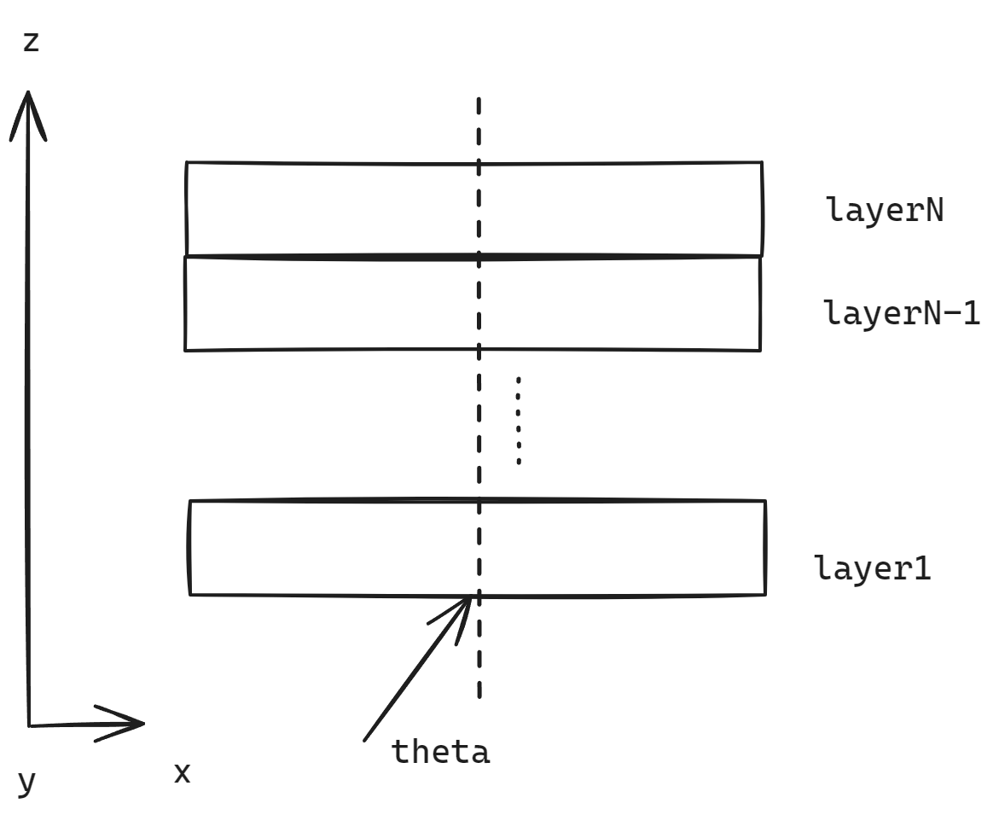

# 传输矩阵法C++代码实现

## 原理
传输矩阵法是一种用于分析和设计多层光学、电磁学或声学系统的方法。它通过将系统分解为一系列基本层，并利用矩阵运算来描述每层对波的传播特性的影响，从而高效地计算整个系统的传输或反射特性。这种方法广泛应用于光学薄膜设计、光波导分析、声学多层结构分析等领域。



## 使用
使用Visual Studio 2022开发，C++矩阵计算库Armadillo，CMAKE构建。

### 用法
器件结构的输入文件为content.json，数据结构如下
```
{
    "device": [
        {
            "thickness": 1e-6,  //第一层
            "indexReal": 1,
            "indexImag": 0.1
        },
        .
        .
        .
        {
            "thickness": 1e-6,  //第N-1层
            "indexReal": 2,
            "indexImag": 0.2
        },
        {
            "thickness": 1e-6,  //第N层
            "indexReal": 3,
            "indexImag": 0.3
        }
    ],
    "source": {
        "theta": 30,        
        "lambda": 1.55e-6
    }
}


```

## 测试模型

| Layer | thickness(um) | Index(Re) | Index(Im)|
| ---|---|---|---|
|1| 1|1|0|
|2|0.5|1.4|0|
|3|0.1|3.4|0|
|4|0.5|1.4|0|
|5|1|0.05|3|
 

### 波长扫描

|theta min|theta max| theta points|
|---|---|---|
|30|30|1|

|lambda min|lambda max| lambda points|
|---|---|---|
|1e-6|2e-6|100|


### 角度扫描

|theta min|theta max| theta points|
|---|---|---|
|0|89.9|100|

|lambda min|lambda max| lambda points|
|---|---|---|
|1.5e-6|1.5e-6|1|


### 复合扫描
|theta min|theta max| theta points|
|---|---|---|
|0|60|4|

|lambda min|lambda max| lambda points|
|---|---|---|
|1e-6|2e-6|100|


### 结论
从中可以看出，对于该结构，随着入射角的增大，反射率谐振波长蓝移，透射率红移。


## 总结

有意思点个赞🤭
🍆🍑😩👉👌💦